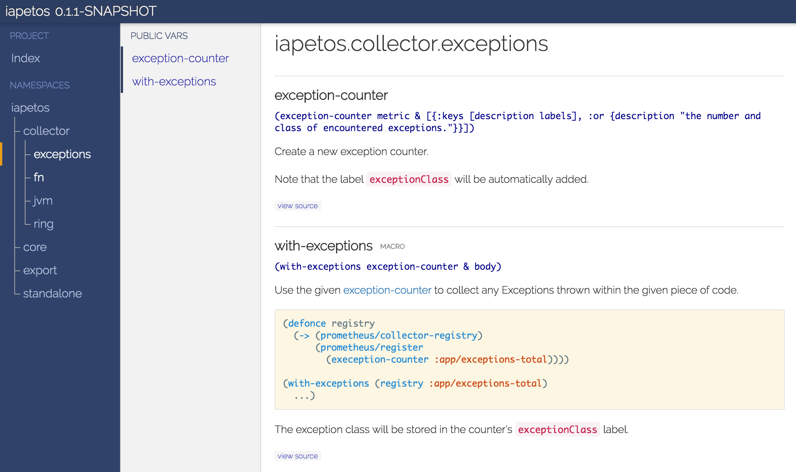
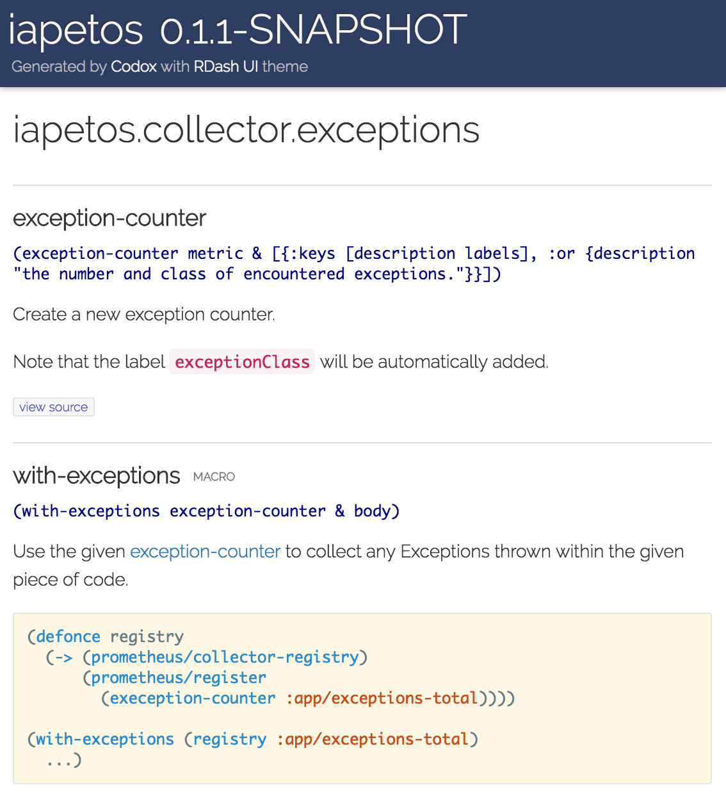

# codox-theme-rdash

This is a modern and responsive [codox][codox] theme, partially inspired by the
styling of [RDash UI][rdash].

Note that this needs codox ≥ 0.10.0.

[codox]: https://github.com/weavejester/codox
[rdash]: http://rdash.github.io/

## Screenshots




## Usage

Add the following dependency to your `project.clj`:

[](https://clojars.org/codox-theme-rdash)

Then set the following:

```clojure
:codox {:themes [:rdash]}
```

For syntax highlighting capabilities, you'll need to activate Markdown rendering
via:

```clojure
:codox {:metadata {:doc/format :markdown}
        :themes [:rdash]}
```

## License

Copyright &copy; 2016 Yannick Scherer

This project is licensed under the [Eclipse Public License 1.0][license].

[license]: https://www.eclipse.org/legal/epl-v10.html

## Derivative

This theme is based on the codox default assets licensed under the
[Eclipse Public License v1.0][epl]:

Copyright &copy; 2016 James Reeves

[epl]: http://www.eclipse.org/legal/epl-v10.html
