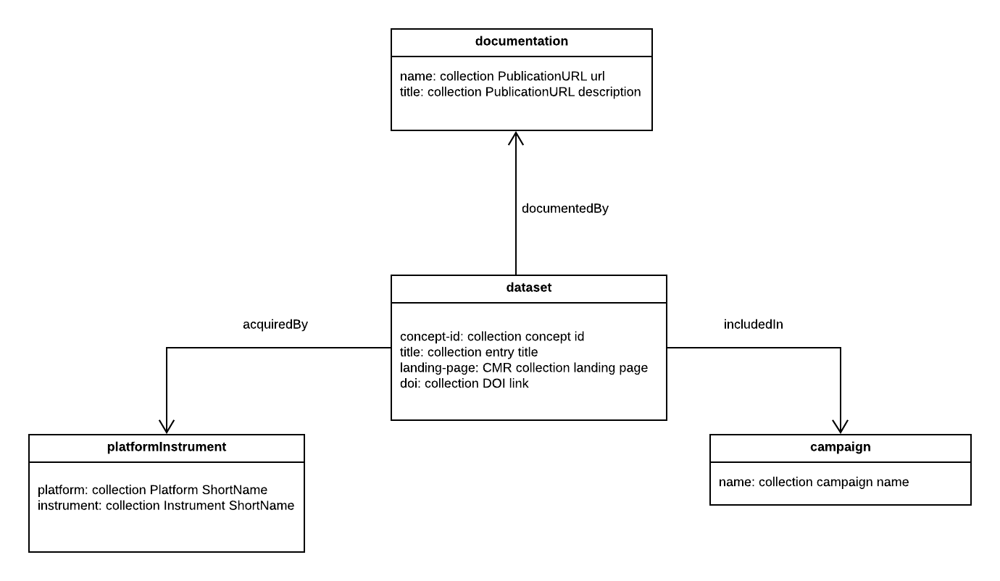

# cmr-graph-db

Nodejs application to perform graph db operations in CMR

# Development Environment

## Prerequisites
* [Nodejs](https://nodejs.org/en/)
* [Docker](https://docs.docker.com/install/)
* [Tinkerpop](https://tinkerpop.apache.org/)

### Node
CMR graph-db runs on Node.js, in order to run the application you'll need to install nodejs.

##### NVM
To ensure that you're using the correct version of Node, it is recommended that you use Node Version Manager. Installation instructions can be found on [the repository](https://github.com/nvm-sh/nvm#install--update-script). The version used is defined in .nvmrc and will be used automatically if NVM is configured correctly.

### NPM
npm is a separate project from Node.js, and tends to update more frequently. As a result, even if you’ve just downloaded Node.js (and therefore npm), you’ll probably need to update your npm. Luckily, npm knows how to update itself! To update your npm, type this into your terminal:

```
npm install -g npm@latest
```

### Docker
Download docker on https://docs.docker.com/get-docker/

### TinkerPop
Apache TinkerPop™ is an open source, vendor-agnostic, graph computing framework distributed under the commercial friendly Apache2 license. When a data system is TinkerPop-enabled, its users are able to model their domain as a graph and analyze that graph using the Gremlin graph traversal language. We use the default Gremlin Server TinkerGraph db and Tinkerpop Gremlin Console in our local development.

### Gremlin Server
Gremlin Server provides a way to remotely execute Gremlin against one or more Graph instances hosted within it. We use the default Gremlin Server TinkerGraph db as our local development graph db. To start Gremlin Server, run:

```
docker run --rm -it -p 8182:8182 tinkerpop/gremlin-server
```

If you want to load existing local data into Gremlin Server, you can add `-v <path_to_cmr_graph-db>/data:/data` to map a local directory with data to the docker instance. Replace the `<path_to_cmr_graphdb>` with the path to your local data directory.

The Gremlin server can be started with multiple configurations. By default it uses a websockets but, it can be configured to use http by running:

```
docker run --rm -p 8182:8182 tinkerpop/gremlin-server conf/gremlin-server-rest-modern.yaml
```

Http requests can then be sent to the gremlin-server using the form:

```
curl -XPOST http://localhost:8182  -d '{"gremlin":"g.V().count()"}'
```
### Gremlin Console
The Gremlin Console is a REPL environment that allows user to experiment with a variety of TinkerPop-related activities, such as loading data, administering graphs and working out complex traversals. We use Gremlin Console to connect to the Gremlin Server and explore the graph db in local development. To start it, run:

```
docker run -it -p 8182:8182 --network host tinkerpop/gremlin-console
```

Then connect to the Gremlin Server and run Gremlin queries in the console, e.g.

```
:remote connect tinkerpop.server conf/remote.yaml
:remote console
g.V().count()
```

### Graphexp
Graphexp is a lightweight web interface to explore and display a graph stored in a Gremlin graph database, via the Gremlin server. This is an easy way to visualize nodes and edges in the graph database.
Clone the graphexp repository at https://github.com/bricaud/graphexp

## Serverless Applications
There are two serverless applications that interact with the graph database:

### Bootstrap

  Bootstrap is a serverless application that load all collections from a CMR environment (SIT, UAT, PROD) into the graph database.

### Indexer

  Indexer is a serverless application that is connected to a SQS queue that is associated with the live CMR collection ingest/update events. It will index new CMR collection ingest/update into the graph database.

### Build
```
npm install
```

### Test
To run the test suite one time run
```
npm run test
```

To run the test suite in watch mode, run
```
npm run test -- --watch
```

### Deploy
To deploy the graph indexer application into a CMR environment, run the following command (e.g. in SIT environment):
```
export AWS_PROFILE=cmr-sit
npm run deploy -- --stage sit
```

### Rollback
To roll back the deployed graph indexer application in a CMR environment, run the following command (e.g. in SIT environment):
```
export AWS_PROFILE=cmr-sit
serverless remove -v --stage sit
```

### Run Bootstrap
To bootstrap all CMR collections from the CMR environment as specified in the deployment (default in serverless.yml) to graph db, send the following test event in the deployed bootstrap lambda function in AWS.

```
{
  "Records": [
    {
      "body": "{}"
    }
  ]
}
```

To bootstrap all collections in a specific provider (e.g LPDAAC_TS2), send the following test event:
```
{
  "Records": [
    {
      "body": "{\"provider-id\": \"LPDAAC_TS2\"}"
    }
  ]
}
```

## Explore Indexed Data
CMR graph database is a Neptune database hosted on AWS. Currently, we index collections and their related urls, projects, platforms and instruments as vertices in the graph database. See the following diagram for details:



### Access via SSH tunnel and Gremlin Console locally
For users who have access to AWS Neptune endpoint via an internal jumpbox, they can set up SSH tunnel to the Neptune endpoint and start Gremlin Console locally to connect to the Neptune endpoint. Then, they can use Gremlin console to explore the graph database as if it is local.

Prerequisites: User must have ssh access to the internal jumpbox that has access to Neptune endpoint.

See [this AWS document](https://docs.aws.amazon.com/neptune/latest/userguide/access-graph-gremlin-console.html) on how to set up the Gremlin Console to connect to a Neptune DB instance.

Happy exploring!
