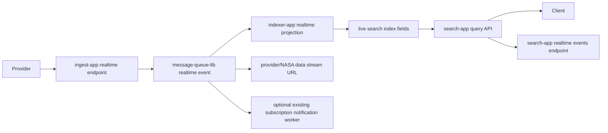

# CMR Realtime Architecture

## Goal

Allow data providers to make new Earth science data discoverable and accessible immediately
after publication, while preserving CMR's validation, authorization, metadata indexing, and
search responsibilities.

Strict physical zero latency is impossible, but CMR can remove the blocking wait between upload
and access by publishing provider events immediately and allowing validation/certification to
advance progressively.

## Fit With The Current Codebase

The current CMR repository is a multi-application Clojure system. The realtime skeleton maps to
the same application boundaries:

- `ingest-app` remains the provider-facing write surface.
- `message-queue-lib` remains the internal event abstraction.
- `indexer-app` remains responsible for projecting metadata into Elasticsearch.
- `search-app` remains the public discovery API.
- `metadata-db-app` remains the durable metadata authority for certified/finalized concepts.
- `subscription` can optionally consume realtime metadata events, but its existing name means
  CMR notification subscriptions, not transport-level stream subscription.

## Proposed Flow



## Event Model

Realtime data is modeled as a stream of granule lifecycle events:

- `:granule-created`
- `:granule-chunk-available`
- `:granule-updated`
- `:granule-closed`
- `:granule-retracted`
- `:quality-updated`

Each event is wrapped in a shared envelope with:

- `:event-id`
- `:event-type`
- `:provider-id`
- `:collection-concept-id`
- `:native-id`
- `:occurred-at`
- `:validation-state`
- `:stream-state`
- `:sequence`
- `:links`
- `:metadata`

This lets CMR expose provisional records immediately while later events refine quality,
certification, data links, and final granule closure.

## Validation Model

Validation becomes progressive rather than blocking:

- `:received`
- `:schema-valid`
- `:metadata-valid`
- `:spatial-temporal-valid`
- `:science-quality-pending`
- `:certified`
- `:failed`
- `:retracted`

Search clients can choose whether they accept provisional data:

```http
GET /search/granules.json?realtime=true&validation_state=received&validation_state=certified
```

## Search Model

Existing CMR granule search remains the main discovery mechanism. Realtime adds filterable
fields and stream links:

- `realtime`
- `stream_state`
- `validation_state`
- `event_sequence`
- `latest_event_time`
- `stream_href`

This keeps old clients stable while giving realtime clients a clear opt-in surface.

## Access Model

CMR should broker discovery and authorization, not necessarily proxy all bytes. Search results
and realtime events should return access links such as:

```json
{
  "rel": "stream",
  "href": "https://data-provider.example/granules/G123/stream",
  "type": "application/octet-stream",
  "inherited": false
}
```

The actual data plane may be provider-hosted, NASA-hosted, HTTP chunked transfer, range-readable
objects, Zarr, COG, NetCDF streaming profiles, or another domain-specific transport.

## Subscription Integration

The existing `subscription` service should not be treated as the realtime transport. However,
it can consume realtime metadata events to reduce notification delay for users who have saved
CMR subscription queries. In that model:

- realtime event arrives
- event is projected into searchable metadata
- subscription worker checks whether saved subscription queries match
- notification is sent earlier than the current scheduled lookback flow

This is downstream notification integration, not the core streaming API.

